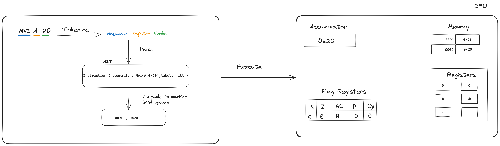

# Contributing to 8085 Emulator

Thank you for considering contributing to the 8085 Emulator! We welcome all kinds of contributions, including bug reports, feature requests, code improvements, and more. To ensure a smooth and efficient contribution process, please take a moment to review the guidelines below.

## Reporting Issues

If you encounter any issues or bugs, please feel free to submit them through the GitHub issue tracker. When submitting an issue, be sure to include:

- A clear and descriptive title
- Detailed steps to reproduce the issue
- Information about your environment (e.g., operating system, Rust version)
- Any relevant error messages or screenshots

## Making Contributions

We appreciate any improvements or new features you can bring to the 8085 Emulator project. Here's how you can contribute:

1. **Fork** the repository and create a new branch for your contribution.
2. **Commit** your changes with clear and concise messages.
3. **Test** your changes thoroughly to ensure they do not introduce any regressions.
4. **Submit** a pull request, providing a detailed explanation of the changes you have made.

## How it works ?


## Development Setup

To set up the development environment for the 8085 Emulator, follow these steps:

1. Clone the repository from GitHub:

   ```
   git clone https://github.com/dibashthapa/8085emulator
   ```

2. Install Rust and Cargo if you haven't already.

3. Install the required dependencies by running:

   ```
   cargo build
   ```

4. You can run tests with:

   ```
   cargo test
   ```

## Codebase Structure

Our codebase follows a specific structure to maintain consistency and readability:

- `cpu.rs`: Contains the interpreter to execute parsed data.
- `token.rs`: Lists the tokens parsed from the string.
- `parser.rs`: Parses the tokens into Rust enums.
- `memory.rs`: Read and write operations to the memory address

If you're contributing new features, ensure they align with the existing code structure and follow Rust's best practices.

## Code Formatting

Please adhere to the Rust community's formatting guidelines. You can use the following command to format your code:

```
cargo fmt
```

## Code Review Process

All contributions will be reviewed to maintain code quality and consistency. We appreciate your patience during the review process and encourage you to respond to any feedback provided.

## Contact

If you have any questions or need further clarification, feel free to reach out to us via the issue tracker.

Thank you for your interest in contributing to the 8085 Emulator project!

---