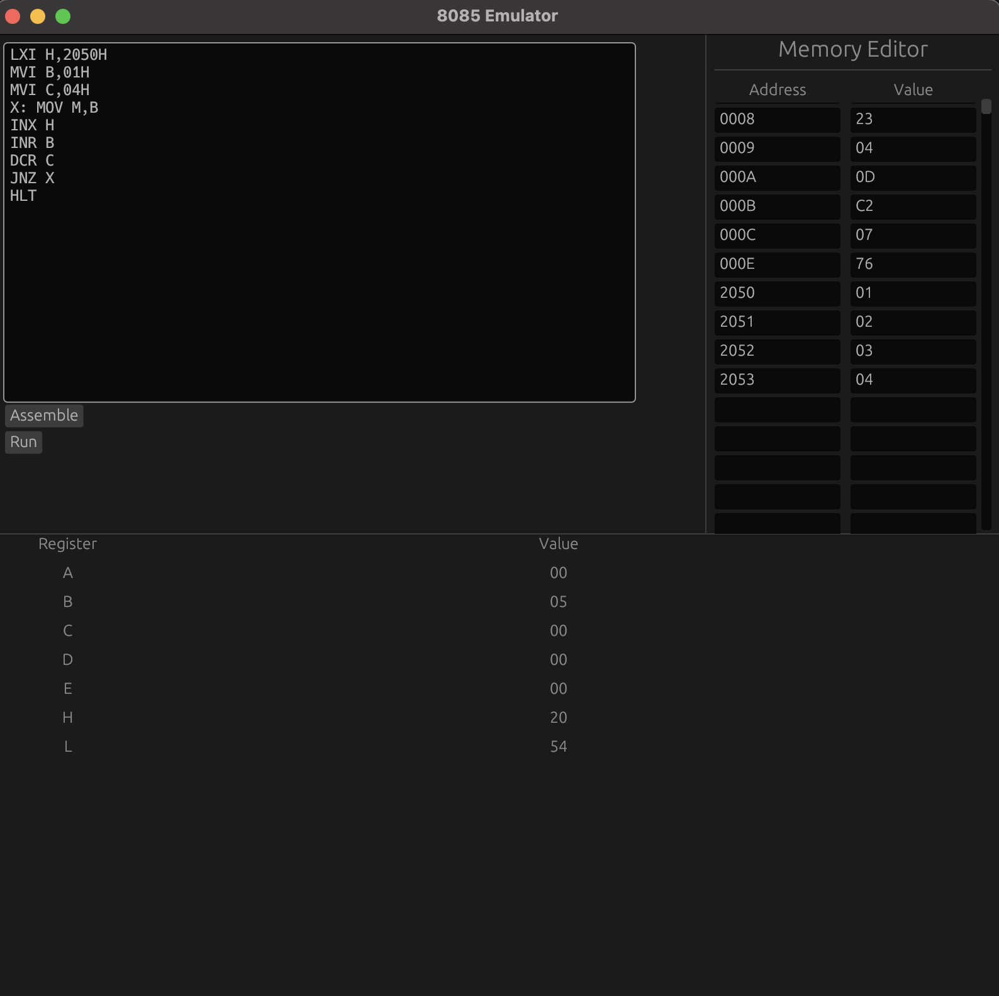

# 8085 Microprocessor Emulator

Emulator for 8085 from scratch using Rust.



## Documentation

See the [documentation](DOCUMENTATION.md) for more information.

## Installation

Install with cargo

```bash
cargo build
```

## Lessons Learned

I shouldn't have skipped my digital logic classes.

## Roadmap

- Support all the 8085 instructions. Please refer to the [instruction set](https://pastraiser.com/cpu/i8085/i8085_opcodes.html) for more information.

- Support flag registers

## Contributing

Contributions are always welcome!

See the [Contribution](CONTRIBUTING.md) for ways to get started.
